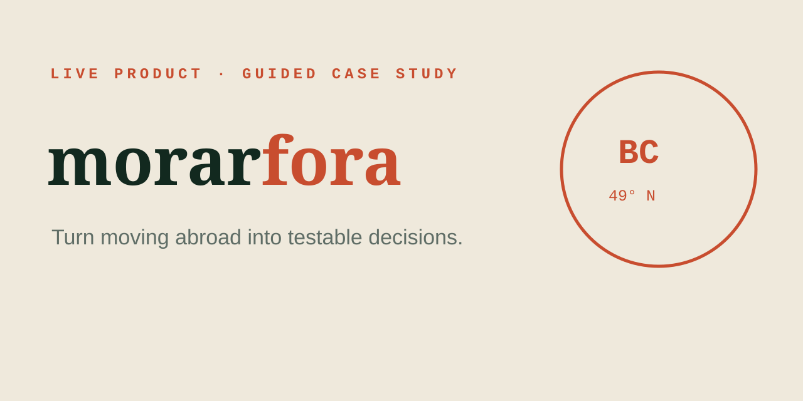

# MorarFora — test two live immigration-planning tools



**A guided public case study for two live, zero-login planning tools built inside a private content product.**

[Try the demo](https://caio-felice-cunha.github.io/morarfora-case-study/) · [Engineering case](https://caio-felice-cunha.github.io/morarfora-case-study/#case) · [View source](https://github.com/Caio-Felice-Cunha/morarfora-case-study) · [Run locally](#run-locally)

## What you can test

1. Use the live [CRS calculator](https://blogmorarfora.com/calcular-crs/) and change one factor to see how the score reacts.
2. Use [Compare cities](https://blogmorarfora.com/comparar-cidades/) to make a trade-off explicit rather than browse generic rankings.

Neither path requires an account. The public case-study repository contains no
copy of the private Astro application, unpublished content, operations data,
analytics exports, tokens, or the TCF study corpus.

## Case study

MorarFora turns high-anxiety research into smaller decisions. The product
combines editorial guidance with tools that expose inputs, preserve context,
and make trade-offs visible. This repository is the public inspection layer:
it gives visitors a test script and links them to the real product.

## Product architecture

The private product uses Astro to render editorial and reference content
statically. Small client-side islands own only the interactive calculator and
comparison state, keeping the majority of each route usable without a large
application bundle.

### CRS flow

Versioned scoring tables map age, education, language, work history, spouse,
and transferability inputs into subtotals and a transparent final score. The
case page documents this private implementation as labelled pseudocode and
describes how source dates and update checks are recorded.

### City-comparison flow

Versioned city facts are normalized into comparable dimensions. The interface
keeps the original values visible while helping the user inspect trade-offs; it
does not collapse a personal decision into an unexplained universal ranking.

## Quality and data provenance

- Content tests permit only the two approved public product routes.
- Browser tests cover the guided flows, technical narrative, keyboard-visible
  controls, and responsive layout.
- Link checks verify both live routes independently from the static case.
- Source updates require a citation, effective date, transformation note, and
  review of affected calculator or comparison tests.

## Run locally

```bash
npm install
npm run serve
```

Open `http://localhost:4175`. `npm run test:all` exercises the guide and checks
the two external routes without treating a transient server failure as a code
regression.

## Limitations

- This repository is a case study, not the product source.
- Calculator output is educational and is not immigration advice.
- TCF simulations are intentionally outside this first public release.

## License

The case-study code is MIT licensed. MorarFora brand and authored content remain
© 2026 Caio Di Felice Cunha.
